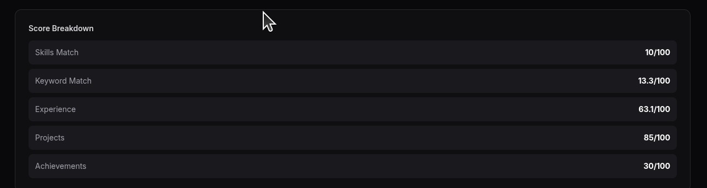
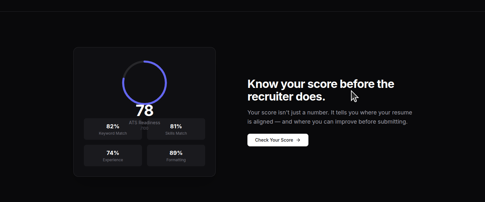

This is unncessary since above it is already showing 
increase the interview question count 

This is the result i get when i click on generate the resume 
Traceback (most recent call last):
  File "/home/yashas-bhagwat/FULL-RAG/.venv/lib/python3.12/site-packages/starlette/middleware/errors.py", line 164, in __call__
    await self.app(scope, receive, _send)
  File "/home/yashas-bhagwat/FULL-RAG/.venv/lib/python3.12/site-packages/starlette/middleware/base.py", line 193, in __call__
    response = await self.dispatch_func(request, call_next)
               ^^^^^^^^^^^^^^^^^^^^^^^^^^^^^^^^^^^^^^^^^^^^
  File "/home/yashas-bhagwat/AI_RESUME_ENHANCER/app/server.py", line 67, in log_requests
    response = await call_next(request)
               ^^^^^^^^^^^^^^^^^^^^^^^^
  File "/home/yashas-bhagwat/FULL-RAG/.venv/lib/python3.12/site-packages/starlette/middleware/base.py", line 168, in call_next
    raise app_exc from app_exc.__cause__ or app_exc.__context__
  File "/home/yashas-bhagwat/FULL-RAG/.venv/lib/python3.12/site-packages/starlette/middleware/base.py", line 144, in coro
    await self.app(scope, receive_or_disconnect, send_no_error)
  File "/home/yashas-bhagwat/FULL-RAG/.venv/lib/python3.12/site-packages/starlette/middleware/cors.py", line 96, in __call__
    await self.simple_response(scope, receive, send, request_headers=headers)
  File "/home/yashas-bhagwat/FULL-RAG/.venv/lib/python3.12/site-packages/starlette/middleware/cors.py", line 154, in simple_response
    await self.app(scope, receive, send)
  File "/home/yashas-bhagwat/FULL-RAG/.venv/lib/python3.12/site-packages/starlette/middleware/exceptions.py", line 63, in __call__
    await wrap_app_handling_exceptions(self.app, conn)(scope, receive, send)
  File "/home/yashas-bhagwat/FULL-RAG/.venv/lib/python3.12/site-packages/starlette/_exception_handler.py", line 53, in wrapped_app
    raise exc
  File "/home/yashas-bhagwat/FULL-RAG/.venv/lib/python3.12/site-packages/starlette/_exception_handler.py", line 42, in wrapped_app
    await app(scope, receive, sender)
  File "/home/yashas-bhagwat/FULL-RAG/.venv/lib/python3.12/site-packages/fastapi/middleware/asyncexitstack.py", line 18, in __call__
    await self.app(scope, receive, send)
  File "/home/yashas-bhagwat/FULL-RAG/.venv/lib/python3.12/site-packages/starlette/routing.py", line 660, in __call__
    await self.middleware_stack(scope, receive, send)
  File "/home/yashas-bhagwat/FULL-RAG/.venv/lib/python3.12/site-packages/fastapi/routing.py", line 2734, in app
    await route.handle(scope, receive, send)
  File "/home/yashas-bhagwat/FULL-RAG/.venv/lib/python3.12/site-packages/fastapi/routing.py", line 1281, in handle
    await super().handle(scope, receive, send)
  File "/home/yashas-bhagwat/FULL-RAG/.venv/lib/python3.12/site-packages/starlette/routing.py", line 276, in handle
    await self.app(scope, receive, send)
  File "/home/yashas-bhagwat/FULL-RAG/.venv/lib/python3.12/site-packages/fastapi/routing.py", line 158, in app
    await wrap_app_handling_exceptions(app, request)(scope, receive, send)
  File "/home/yashas-bhagwat/FULL-RAG/.venv/lib/python3.12/site-packages/starlette/_exception_handler.py", line 53, in wrapped_app
    raise exc
  File "/home/yashas-bhagwat/FULL-RAG/.venv/lib/python3.12/site-packages/starlette/_exception_handler.py", line 42, in wrapped_app
    await app(scope, receive, sender)
  File "/home/yashas-bhagwat/FULL-RAG/.venv/lib/python3.12/site-packages/fastapi/routing.py", line 144, in app
    response = await f(request)
               ^^^^^^^^^^^^^^^^
  File "/home/yashas-bhagwat/FULL-RAG/.venv/lib/python3.12/site-packages/fastapi/routing.py", line 706, in app
    raw_response = await run_endpoint_function(
                   ^^^^^^^^^^^^^^^^^^^^^^^^^^^^
  File "/home/yashas-bhagwat/FULL-RAG/.venv/lib/python3.12/site-packages/fastapi/routing.py", line 352, in run_endpoint_function
    return await dependant.call(**values)
           ^^^^^^^^^^^^^^^^^^^^^^^^^^^^^^
  File "/home/yashas-bhagwat/AI_RESUME_ENHANCER/app/server.py", line 314, in rewrite_resume
    new_state = await node_fn(state)
                ^^^^^^^^^^^^^^^^^^^^
  File "/home/yashas-bhagwat/AI_RESUME_ENHANCER/graph/nodes/resume_rewriter.py", line 43, in node
    result = await ai_service.generate(
             ^^^^^^^^^^^^^^^^^^^^^^^^^^
  File "/home/yashas-bhagwat/AI_RESUME_ENHANCER/app/ai_service.py", line 429, in generate
    raise ValueError(f"No JSON found in LLM response: {raw[:200]}")
ValueError: No JSON found in LLM response: {"improved_resume": `

[...truncated...]

{"summary": "Enhanced technical skills in Java, Python, and C++, along with microservices, distributed computing, and cloud platforms (AWS). Demonstrated inno
INFO:     127.0.0.1:35582 - "POST /rewrite HTTP/1.1" 500 Internal Server Error
ERROR:    Exception in ASGI application
Traceback (most recent call last):
  File "/home/yashas-bhagwat/FULL-RAG/.venv/lib/python3.12/site-packages/uvicorn/protocols/http/h11_impl.py", line 416, in run_asgi
    result = await app(  # type: ignore[func-returns-value]
             ^^^^^^^^^^^^^^^^^^^^^^^^^^^^^^^^^^^^^^^^^^^^^^
  File "/home/yashas-bhagwat/FULL-RAG/.venv/lib/python3.12/site-packages/uvicorn/middleware/proxy_headers.py", line 63, in __call__
    return await self.app(scope, receive, send)
           ^^^^^^^^^^^^^^^^^^^^^^^^^^^^^^^^^^^^
  File "/home/yashas-bhagwat/FULL-RAG/.venv/lib/python3.12/site-packages/fastapi/applications.py", line 1163, in __call__
    await super().__call__(scope, receive, send)
  File "/home/yashas-bhagwat/FULL-RAG/.venv/lib/python3.12/site-packages/starlette/applications.py", line 90, in __call__
    await self.middleware_stack(scope, receive, send)
  File "/home/yashas-bhagwat/FULL-RAG/.venv/lib/python3.12/site-packages/starlette/middleware/errors.py", line 186, in __call__
    raise exc
  File "/home/yashas-bhagwat/FULL-RAG/.venv/lib/python3.12/site-packages/starlette/middleware/errors.py", line 164, in __call__
    await self.app(scope, receive, _send)
  File "/home/yashas-bhagwat/FULL-RAG/.venv/lib/python3.12/site-packages/starlette/middleware/base.py", line 193, in __call__
    response = await self.dispatch_func(request, call_next)
               ^^^^^^^^^^^^^^^^^^^^^^^^^^^^^^^^^^^^^^^^^^^^
  File "/home/yashas-bhagwat/AI_RESUME_ENHANCER/app/server.py", line 67, in log_requests
    response = await call_next(request)
               ^^^^^^^^^^^^^^^^^^^^^^^^
  File "/home/yashas-bhagwat/FULL-RAG/.venv/lib/python3.12/site-packages/starlette/middleware/base.py", line 168, in call_next
    raise app_exc from app_exc.__cause__ or app_exc.__context__
  File "/home/yashas-bhagwat/FULL-RAG/.venv/lib/python3.12/site-packages/starlette/middleware/base.py", line 144, in coro
    await self.app(scope, receive_or_disconnect, send_no_error)
  File "/home/yashas-bhagwat/FULL-RAG/.venv/lib/python3.12/site-packages/starlette/middleware/cors.py", line 96, in __call__
    await self.simple_response(scope, receive, send, request_headers=headers)
  File "/home/yashas-bhagwat/FULL-RAG/.venv/lib/python3.12/site-packages/starlette/middleware/cors.py", line 154, in simple_response
    await self.app(scope, receive, send)
  File "/home/yashas-bhagwat/FULL-RAG/.venv/lib/python3.12/site-packages/starlette/middleware/exceptions.py", line 63, in __call__
    await wrap_app_handling_exceptions(self.app, conn)(scope, receive, send)
  File "/home/yashas-bhagwat/FULL-RAG/.venv/lib/python3.12/site-packages/starlette/_exception_handler.py", line 53, in wrapped_app
    raise exc
  File "/home/yashas-bhagwat/FULL-RAG/.venv/lib/python3.12/site-packages/starlette/_exception_handler.py", line 42, in wrapped_app
    await app(scope, receive, sender)
  File "/home/yashas-bhagwat/FULL-RAG/.venv/lib/python3.12/site-packages/fastapi/middleware/asyncexitstack.py", line 18, in __call__
    await self.app(scope, receive, send)
  File "/home/yashas-bhagwat/FULL-RAG/.venv/lib/python3.12/site-packages/starlette/routing.py", line 660, in __call__
    await self.middleware_stack(scope, receive, send)
  File "/home/yashas-bhagwat/FULL-RAG/.venv/lib/python3.12/site-packages/fastapi/routing.py", line 2734, in app
    await route.handle(scope, receive, send)
  File "/home/yashas-bhagwat/FULL-RAG/.venv/lib/python3.12/site-packages/fastapi/routing.py", line 1281, in handle
    await super().handle(scope, receive, send)
  File "/home/yashas-bhagwat/FULL-RAG/.venv/lib/python3.12/site-packages/starlette/routing.py", line 276, in handle
    await self.app(scope, receive, send)
  File "/home/yashas-bhagwat/FULL-RAG/.venv/lib/python3.12/site-packages/fastapi/routing.py", line 158, in app
    await wrap_app_handling_exceptions(app, request)(scope, receive, send)
  File "/home/yashas-bhagwat/FULL-RAG/.venv/lib/python3.12/site-packages/starlette/_exception_handler.py", line 53, in wrapped_app
    raise exc
  File "/home/yashas-bhagwat/FULL-RAG/.venv/lib/python3.12/site-packages/starlette/_exception_handler.py", line 42, in wrapped_app
    await app(scope, receive, sender)
  File "/home/yashas-bhagwat/FULL-RAG/.venv/lib/python3.12/site-packages/fastapi/routing.py", line 144, in app
    response = await f(request)
               ^^^^^^^^^^^^^^^^
  File "/home/yashas-bhagwat/FULL-RAG/.venv/lib/python3.12/site-packages/fastapi/routing.py", line 706, in app
    raw_response = await run_endpoint_function(
                   ^^^^^^^^^^^^^^^^^^^^^^^^^^^^
  File "/home/yashas-bhagwat/FULL-RAG/.venv/lib/python3.12/site-packages/fastapi/routing.py", line 352, in run_endpoint_function
    return await dependant.call(**values)
           ^^^^^^^^^^^^^^^^^^^^^^^^^^^^^^
  File "/home/yashas-bhagwat/AI_RESUME_ENHANCER/app/server.py", line 314, in rewrite_resume
    new_state = await node_fn(state)
                ^^^^^^^^^^^^^^^^^^^^
  File "/home/yashas-bhagwat/AI_RESUME_ENHANCER/graph/nodes/resume_rewriter.py", line 43, in node
    result = await ai_service.generate(
             ^^^^^^^^^^^^^^^^^^^^^^^^^^
  File "/home/yashas-bhagwat/AI_RESUME_ENHANCER/app/ai_service.py", line 429, in generate
    raise ValueError(f"No JSON found in LLM response: {raw[:200]}")
ValueError: No JSON found in LLM response: {"improved_resume": `

[...truncated...]

{"summary": "Enhanced technical skills in Java, Python, and C++, along with microservices, distributed computing, and cloud platforms (AWS). Demonstrated inno
All JSON extraction methods failed for response of 2303 chars
No JSON found (attempt 1), response length=3773
Unhandled exception on POST /rewrite: No JSON found in LLM response: {"improved_resume": `

[
{
  "Name": "Kushal KV",
  "Contact": "+91-9886489229, kushalkv@gmail.com",
  "Summary": "Experienced software engineer with expertise in Java, Python, and C++. Proficient in 
Traceback (most recent call last):
  File "/home/yashas-bhagwat/FULL-RAG/.venv/lib/python3.12/site-packages/starlette/middleware/errors.py", line 164, in __call__
    await self.app(scope, receive, _send)
  File "/home/yashas-bhagwat/FULL-RAG/.venv/lib/python3.12/site-packages/starlette/middleware/base.py", line 193, in __call__
    response = await self.dispatch_func(request, call_next)
               ^^^^^^^^^^^^^^^^^^^^^^^^^^^^^^^^^^^^^^^^^^^^
  File "/home/yashas-bhagwat/AI_RESUME_ENHANCER/app/server.py", line 67, in log_requests
    response = await call_next(request)
               ^^^^^^^^^^^^^^^^^^^^^^^^
  File "/home/yashas-bhagwat/FULL-RAG/.venv/lib/python3.12/site-packages/starlette/middleware/base.py", line 168, in call_next
    raise app_exc from app_exc.__cause__ or app_exc.__context__
  File "/home/yashas-bhagwat/FULL-RAG/.venv/lib/python3.12/site-packages/starlette/middleware/base.py", line 144, in coro
    await self.app(scope, receive_or_disconnect, send_no_error)
  File "/home/yashas-bhagwat/FULL-RAG/.venv/lib/python3.12/site-packages/starlette/middleware/cors.py", line 96, in __call__
    await self.simple_response(scope, receive, send, request_headers=headers)
  File "/home/yashas-bhagwat/FULL-RAG/.venv/lib/python3.12/site-packages/starlette/middleware/cors.py", line 154, in simple_response
    await self.app(scope, receive, send)
  File "/home/yashas-bhagwat/FULL-RAG/.venv/lib/python3.12/site-packages/starlette/middleware/exceptions.py", line 63, in __call__
    await wrap_app_handling_exceptions(self.app, conn)(scope, receive, send)
  File "/home/yashas-bhagwat/FULL-RAG/.venv/lib/python3.12/site-packages/starlette/_exception_handler.py", line 53, in wrapped_app
    raise exc
  File "/home/yashas-bhagwat/FULL-RAG/.venv/lib/python3.12/site-packages/starlette/_exception_handler.py", line 42, in wrapped_app
    await app(scope, receive, sender)
  File "/home/yashas-bhagwat/FULL-RAG/.venv/lib/python3.12/site-packages/fastapi/middleware/asyncexitstack.py", line 18, in __call__
    await self.app(scope, receive, send)
  File "/home/yashas-bhagwat/FULL-RAG/.venv/lib/python3.12/site-packages/starlette/routing.py", line 660, in __call__
    await self.middleware_stack(scope, receive, send)
  File "/home/yashas-bhagwat/FULL-RAG/.venv/lib/python3.12/site-packages/fastapi/routing.py", line 2734, in app
    await route.handle(scope, receive, send)
  File "/home/yashas-bhagwat/FULL-RAG/.venv/lib/python3.12/site-packages/fastapi/routing.py", line 1281, in handle
    await super().handle(scope, receive, send)
  File "/home/yashas-bhagwat/FULL-RAG/.venv/lib/python3.12/site-packages/starlette/routing.py", line 276, in handle
    await self.app(scope, receive, send)
  File "/home/yashas-bhagwat/FULL-RAG/.venv/lib/python3.12/site-packages/fastapi/routing.py", line 158, in app
    await wrap_app_handling_exceptions(app, request)(scope, receive, send)
  File "/home/yashas-bhagwat/FULL-RAG/.venv/lib/python3.12/site-packages/starlette/_exception_handler.py", line 53, in wrapped_app
    raise exc
  File "/home/yashas-bhagwat/FULL-RAG/.venv/lib/python3.12/site-packages/starlette/_exception_handler.py", line 42, in wrapped_app
    await app(scope, receive, sender)
  File "/home/yashas-bhagwat/FULL-RAG/.venv/lib/python3.12/site-packages/fastapi/routing.py", line 144, in app
    response = await f(request)
               ^^^^^^^^^^^^^^^^
  File "/home/yashas-bhagwat/FULL-RAG/.venv/lib/python3.12/site-packages/fastapi/routing.py", line 706, in app
    raw_response = await run_endpoint_function(
                   ^^^^^^^^^^^^^^^^^^^^^^^^^^^^
  File "/home/yashas-bhagwat/FULL-RAG/.venv/lib/python3.12/site-packages/fastapi/routing.py", line 352, in run_endpoint_function
    return await dependant.call(**values)
           ^^^^^^^^^^^^^^^^^^^^^^^^^^^^^^
  File "/home/yashas-bhagwat/AI_RESUME_ENHANCER/app/server.py", line 314, in rewrite_resume
    new_state = await node_fn(state)
                ^^^^^^^^^^^^^^^^^^^^
  File "/home/yashas-bhagwat/AI_RESUME_ENHANCER/graph/nodes/resume_rewriter.py", line 43, in node
    result = await ai_service.generate(
             ^^^^^^^^^^^^^^^^^^^^^^^^^^
  File "/home/yashas-bhagwat/AI_RESUME_ENHANCER/app/ai_service.py", line 429, in generate
    raise ValueError(f"No JSON found in LLM response: {raw[:200]}")
ValueError: No JSON found in LLM response: {"improved_resume": `

[
{
  "Name": "Kushal KV",
  "Contact": "+91-9886489229, kushalkv@gmail.com",
  "Summary": "Experienced software engineer with expertise in Java, Python, and C++. Proficient in 
INFO:     127.0.0.1:60772 - "POST /rewrite HTTP/1.1" 500 Internal Server Error
ERROR:    Exception in ASGI application
Traceback (most recent call last):
  File "/home/yashas-bhagwat/FULL-RAG/.venv/lib/python3.12/site-packages/uvicorn/protocols/http/h11_impl.py", line 416, in run_asgi
    result = await app(  # type: ignore[func-returns-value]
             ^^^^^^^^^^^^^^^^^^^^^^^^^^^^^^^^^^^^^^^^^^^^^^
  File "/home/yashas-bhagwat/FULL-RAG/.venv/lib/python3.12/site-packages/uvicorn/middleware/proxy_headers.py", line 63, in __call__
    return await self.app(scope, receive, send)
           ^^^^^^^^^^^^^^^^^^^^^^^^^^^^^^^^^^^^
  File "/home/yashas-bhagwat/FULL-RAG/.venv/lib/python3.12/site-packages/fastapi/applications.py", line 1163, in __call__
    await super().__call__(scope, receive, send)
  File "/home/yashas-bhagwat/FULL-RAG/.venv/lib/python3.12/site-packages/starlette/applications.py", line 90, in __call__
    await self.middleware_stack(scope, receive, send)
  File "/home/yashas-bhagwat/FULL-RAG/.venv/lib/python3.12/site-packages/starlette/middleware/errors.py", line 186, in __call__
    raise exc
  File "/home/yashas-bhagwat/FULL-RAG/.venv/lib/python3.12/site-packages/starlette/middleware/errors.py", line 164, in __call__
    await self.app(scope, receive, _send)
  File "/home/yashas-bhagwat/FULL-RAG/.venv/lib/python3.12/site-packages/starlette/middleware/base.py", line 193, in __call__
    response = await self.dispatch_func(request, call_next)
               ^^^^^^^^^^^^^^^^^^^^^^^^^^^^^^^^^^^^^^^^^^^^
  File "/home/yashas-bhagwat/AI_RESUME_ENHANCER/app/server.py", line 67, in log_requests
    response = await call_next(request)
               ^^^^^^^^^^^^^^^^^^^^^^^^
  File "/home/yashas-bhagwat/FULL-RAG/.venv/lib/python3.12/site-packages/starlette/middleware/base.py", line 168, in call_next
    raise app_exc from app_exc.__cause__ or app_exc.__context__
  File "/home/yashas-bhagwat/FULL-RAG/.venv/lib/python3.12/site-packages/starlette/middleware/base.py", line 144, in coro
    await self.app(scope, receive_or_disconnect, send_no_error)
  File "/home/yashas-bhagwat/FULL-RAG/.venv/lib/python3.12/site-packages/starlette/middleware/cors.py", line 96, in __call__
    await self.simple_response(scope, receive, send, request_headers=headers)
  File "/home/yashas-bhagwat/FULL-RAG/.venv/lib/python3.12/site-packages/starlette/middleware/cors.py", line 154, in simple_response
    await self.app(scope, receive, send)
  File "/home/yashas-bhagwat/FULL-RAG/.venv/lib/python3.12/site-packages/starlette/middleware/exceptions.py", line 63, in __call__
    await wrap_app_handling_exceptions(self.app, conn)(scope, receive, send)
  File "/home/yashas-bhagwat/FULL-RAG/.venv/lib/python3.12/site-packages/starlette/_exception_handler.py", line 53, in wrapped_app
    raise exc
  File "/home/yashas-bhagwat/FULL-RAG/.venv/lib/python3.12/site-packages/starlette/_exception_handler.py", line 42, in wrapped_app
    await app(scope, receive, sender)
  File "/home/yashas-bhagwat/FULL-RAG/.venv/lib/python3.12/site-packages/fastapi/middleware/asyncexitstack.py", line 18, in __call__
    await self.app(scope, receive, send)
  File "/home/yashas-bhagwat/FULL-RAG/.venv/lib/python3.12/site-packages/starlette/routing.py", line 660, in __call__
    await self.middleware_stack(scope, receive, send)
  File "/home/yashas-bhagwat/FULL-RAG/.venv/lib/python3.12/site-packages/fastapi/routing.py", line 2734, in app
    await route.handle(scope, receive, send)
  File "/home/yashas-bhagwat/FULL-RAG/.venv/lib/python3.12/site-packages/fastapi/routing.py", line 1281, in handle
    await super().handle(scope, receive, send)
  File "/home/yashas-bhagwat/FULL-RAG/.venv/lib/python3.12/site-packages/starlette/routing.py", line 276, in handle
    await self.app(scope, receive, send)
  File "/home/yashas-bhagwat/FULL-RAG/.venv/lib/python3.12/site-packages/fastapi/routing.py", line 158, in app
    await wrap_app_handling_exceptions(app, request)(scope, receive, send)
  File "/home/yashas-bhagwat/FULL-RAG/.venv/lib/python3.12/site-packages/starlette/_exception_handler.py", line 53, in wrapped_app
    raise exc
  File "/home/yashas-bhagwat/FULL-RAG/.venv/lib/python3.12/site-packages/starlette/_exception_handler.py", line 42, in wrapped_app
    await app(scope, receive, sender)
  File "/home/yashas-bhagwat/FULL-RAG/.venv/lib/python3.12/site-packages/fastapi/routing.py", line 144, in app
    response = await f(request)
               ^^^^^^^^^^^^^^^^
  File "/home/yashas-bhagwat/FULL-RAG/.venv/lib/python3.12/site-packages/fastapi/routing.py", line 706, in app
    raw_response = await run_endpoint_function(
                   ^^^^^^^^^^^^^^^^^^^^^^^^^^^^
  File "/home/yashas-bhagwat/FULL-RAG/.venv/lib/python3.12/site-packages/fastapi/routing.py", line 352, in run_endpoint_function
    return await dependant.call(**values)
           ^^^^^^^^^^^^^^^^^^^^^^^^^^^^^^
  File "/home/yashas-bhagwat/AI_RESUME_ENHANCER/app/server.py", line 314, in rewrite_resume
    new_state = await node_fn(state)
                ^^^^^^^^^^^^^^^^^^^^
  File "/home/yashas-bhagwat/AI_RESUME_ENHANCER/graph/nodes/resume_rewriter.py", line 43, in node
    result = await ai_service.generate(
             ^^^^^^^^^^^^^^^^^^^^^^^^^^
  File "/home/yashas-bhagwat/AI_RESUME_ENHANCER/app/ai_service.py", line 429, in generate
    raise ValueError(f"No JSON found in LLM response: {raw[:200]}")
ValueError: No JSON found in LLM response: {"improved_resume": `

[
{
  "Name": "Kushal KV",
  "Contact": "+91-9886489229, kushalkv@gmail.com",
  "Summary": "Experienced software engineer with expertise in Java, Python, and C++. Proficient in 
All JSON extraction methods failed for response of 1219 chars
No JSON found (attempt 1), response length=3225
Unhandled exception on POST /rewrite: No JSON found in LLM response: {"improved_resume": `

{
  "Name": "Kushal KV",
  "Contact Information": {
    "Address": "Bengaluru, Karnataka",
    "Phone Number": "+91-8123456789",
    "Email": "kushalkv@example.com"
  },
  "Summ
Traceback (most recent call last):
  File "/home/yashas-bhagwat/FULL-RAG/.venv/lib/python3.12/site-packages/starlette/middleware/errors.py", line 164, in __call__
    await self.app(scope, receive, _send)
  File "/home/yashas-bhagwat/FULL-RAG/.venv/lib/python3.12/site-packages/starlette/middleware/base.py", line 193, in __call__
    response = await self.dispatch_func(request, call_next)
               ^^^^^^^^^^^^^^^^^^^^^^^^^^^^^^^^^^^^^^^^^^^^
  File "/home/yashas-bhagwat/AI_RESUME_ENHANCER/app/server.py", line 67, in log_requests
    response = await call_next(request)
               ^^^^^^^^^^^^^^^^^^^^^^^^
  File "/home/yashas-bhagwat/FULL-RAG/.venv/lib/python3.12/site-packages/starlette/middleware/base.py", line 168, in call_next
    raise app_exc from app_exc.__cause__ or app_exc.__context__
  File "/home/yashas-bhagwat/FULL-RAG/.venv/lib/python3.12/site-packages/starlette/middleware/base.py", line 144, in coro
    await self.app(scope, receive_or_disconnect, send_no_error)
  File "/home/yashas-bhagwat/FULL-RAG/.venv/lib/python3.12/site-packages/starlette/middleware/cors.py", line 96, in __call__
    await self.simple_response(scope, receive, send, request_headers=headers)
  File "/home/yashas-bhagwat/FULL-RAG/.venv/lib/python3.12/site-packages/starlette/middleware/cors.py", line 154, in simple_response
    await self.app(scope, receive, send)
  File "/home/yashas-bhagwat/FULL-RAG/.venv/lib/python3.12/site-packages/starlette/middleware/exceptions.py", line 63, in __call__
    await wrap_app_handling_exceptions(self.app, conn)(scope, receive, send)
  File "/home/yashas-bhagwat/FULL-RAG/.venv/lib/python3.12/site-packages/starlette/_exception_handler.py", line 53, in wrapped_app
    raise exc
  File "/home/yashas-bhagwat/FULL-RAG/.venv/lib/python3.12/site-packages/starlette/_exception_handler.py", line 42, in wrapped_app
    await app(scope, receive, sender)
  File "/home/yashas-bhagwat/FULL-RAG/.venv/lib/python3.12/site-packages/fastapi/middleware/asyncexitstack.py", line 18, in __call__
    await self.app(scope, receive, send)
  File "/home/yashas-bhagwat/FULL-RAG/.venv/lib/python3.12/site-packages/starlette/routing.py", line 660, in __call__
    await self.middleware_stack(scope, receive, send)
  File "/home/yashas-bhagwat/FULL-RAG/.venv/lib/python3.12/site-packages/fastapi/routing.py", line 2734, in app
    await route.handle(scope, receive, send)
  File "/home/yashas-bhagwat/FULL-RAG/.venv/lib/python3.12/site-packages/fastapi/routing.py", line 1281, in handle
    await super().handle(scope, receive, send)
  File "/home/yashas-bhagwat/FULL-RAG/.venv/lib/python3.12/site-packages/starlette/routing.py", line 276, in handle
    await self.app(scope, receive, send)
  File "/home/yashas-bhagwat/FULL-RAG/.venv/lib/python3.12/site-packages/fastapi/routing.py", line 158, in app
    await wrap_app_handling_exceptions(app, request)(scope, receive, send)
  File "/home/yashas-bhagwat/FULL-RAG/.venv/lib/python3.12/site-packages/starlette/_exception_handler.py", line 53, in wrapped_app
    raise exc
  File "/home/yashas-bhagwat/FULL-RAG/.venv/lib/python3.12/site-packages/starlette/_exception_handler.py", line 42, in wrapped_app
    await app(scope, receive, sender)
  File "/home/yashas-bhagwat/FULL-RAG/.venv/lib/python3.12/site-packages/fastapi/routing.py", line 144, in app
    response = await f(request)
               ^^^^^^^^^^^^^^^^
  File "/home/yashas-bhagwat/FULL-RAG/.venv/lib/python3.12/site-packages/fastapi/routing.py", line 706, in app
    raw_response = await run_endpoint_function(
                   ^^^^^^^^^^^^^^^^^^^^^^^^^^^^
  File "/home/yashas-bhagwat/FULL-RAG/.venv/lib/python3.12/site-packages/fastapi/routing.py", line 352, in run_endpoint_function
    return await dependant.call(**values)
           ^^^^^^^^^^^^^^^^^^^^^^^^^^^^^^
  File "/home/yashas-bhagwat/AI_RESUME_ENHANCER/app/server.py", line 314, in rewrite_resume
    new_state = await node_fn(state)
                ^^^^^^^^^^^^^^^^^^^^
  File "/home/yashas-bhagwat/AI_RESUME_ENHANCER/graph/nodes/resume_rewriter.py", line 43, in node
    result = await ai_service.generate(
             ^^^^^^^^^^^^^^^^^^^^^^^^^^
  File "/home/yashas-bhagwat/AI_RESUME_ENHANCER/app/ai_service.py", line 429, in generate
    raise ValueError(f"No JSON found in LLM response: {raw[:200]}")
ValueError: No JSON found in LLM response: {"improved_resume": `

{
  "Name": "Kushal KV",
  "Contact Information": {
    "Address": "Bengaluru, Karnataka",
    "Phone Number": "+91-8123456789",
    "Email": "kushalkv@example.com"
  },
  "Summ
INFO:     127.0.0.1:58368 - "POST /rewrite HTTP/1.1" 500 Internal Server Error
ERROR:    Exception in ASGI application
Traceback (most recent call last):
  File "/home/yashas-bhagwat/FULL-RAG/.venv/lib/python3.12/site-packages/uvicorn/protocols/http/h11_impl.py", line 416, in run_asgi
    result = await app(  # type: ignore[func-returns-value]
             ^^^^^^^^^^^^^^^^^^^^^^^^^^^^^^^^^^^^^^^^^^^^^^
  File "/home/yashas-bhagwat/FULL-RAG/.venv/lib/python3.12/site-packages/uvicorn/middleware/proxy_headers.py", line 63, in __call__
    return await self.app(scope, receive, send)
           ^^^^^^^^^^^^^^^^^^^^^^^^^^^^^^^^^^^^
  File "/home/yashas-bhagwat/FULL-RAG/.venv/lib/python3.12/site-packages/fastapi/applications.py", line 1163, in __call__
    await super().__call__(scope, receive, send)
  File "/home/yashas-bhagwat/FULL-RAG/.venv/lib/python3.12/site-packages/starlette/applications.py", line 90, in __call__
    await self.middleware_stack(scope, receive, send)
  File "/home/yashas-bhagwat/FULL-RAG/.venv/lib/python3.12/site-packages/starlette/middleware/errors.py", line 186, in __call__
    raise exc
  File "/home/yashas-bhagwat/FULL-RAG/.venv/lib/python3.12/site-packages/starlette/middleware/errors.py", line 164, in __call__
    await self.app(scope, receive, _send)
  File "/home/yashas-bhagwat/FULL-RAG/.venv/lib/python3.12/site-packages/starlette/middleware/base.py", line 193, in __call__
    response = await self.dispatch_func(request, call_next)
               ^^^^^^^^^^^^^^^^^^^^^^^^^^^^^^^^^^^^^^^^^^^^
  File "/home/yashas-bhagwat/AI_RESUME_ENHANCER/app/server.py", line 67, in log_requests
    response = await call_next(request)
               ^^^^^^^^^^^^^^^^^^^^^^^^
  File "/home/yashas-bhagwat/FULL-RAG/.venv/lib/python3.12/site-packages/starlette/middleware/base.py", line 168, in call_next
    raise app_exc from app_exc.__cause__ or app_exc.__context__
  File "/home/yashas-bhagwat/FULL-RAG/.venv/lib/python3.12/site-packages/starlette/middleware/base.py", line 144, in coro
    await self.app(scope, receive_or_disconnect, send_no_error)
  File "/home/yashas-bhagwat/FULL-RAG/.venv/lib/python3.12/site-packages/starlette/middleware/cors.py", line 96, in __call__
    await self.simple_response(scope, receive, send, request_headers=headers)
  File "/home/yashas-bhagwat/FULL-RAG/.venv/lib/python3.12/site-packages/starlette/middleware/cors.py", line 154, in simple_response
    await self.app(scope, receive, send)
  File "/home/yashas-bhagwat/FULL-RAG/.venv/lib/python3.12/site-packages/starlette/middleware/exceptions.py", line 63, in __call__
    await wrap_app_handling_exceptions(self.app, conn)(scope, receive, send)
  File "/home/yashas-bhagwat/FULL-RAG/.venv/lib/python3.12/site-packages/starlette/_exception_handler.py", line 53, in wrapped_app
    raise exc
  File "/home/yashas-bhagwat/FULL-RAG/.venv/lib/python3.12/site-packages/starlette/_exception_handler.py", line 42, in wrapped_app
    await app(scope, receive, sender)
  File "/home/yashas-bhagwat/FULL-RAG/.venv/lib/python3.12/site-packages/fastapi/middleware/asyncexitstack.py", line 18, in __call__
    await self.app(scope, receive, send)
  File "/home/yashas-bhagwat/FULL-RAG/.venv/lib/python3.12/site-packages/starlette/routing.py", line 660, in __call__
    await self.middleware_stack(scope, receive, send)
  File "/home/yashas-bhagwat/FULL-RAG/.venv/lib/python3.12/site-packages/fastapi/routing.py", line 2734, in app
    await route.handle(scope, receive, send)
  File "/home/yashas-bhagwat/FULL-RAG/.venv/lib/python3.12/site-packages/fastapi/routing.py", line 1281, in handle
    await super().handle(scope, receive, send)
  File "/home/yashas-bhagwat/FULL-RAG/.venv/lib/python3.12/site-packages/starlette/routing.py", line 276, in handle
    await self.app(scope, receive, send)
  File "/home/yashas-bhagwat/FULL-RAG/.venv/lib/python3.12/site-packages/fastapi/routing.py", line 158, in app
    await wrap_app_handling_exceptions(app, request)(scope, receive, send)
  File "/home/yashas-bhagwat/FULL-RAG/.venv/lib/python3.12/site-packages/starlette/_exception_handler.py", line 53, in wrapped_app
    raise exc
  File "/home/yashas-bhagwat/FULL-RAG/.venv/lib/python3.12/site-packages/starlette/_exception_handler.py", line 42, in wrapped_app
    await app(scope, receive, sender)
  File "/home/yashas-bhagwat/FULL-RAG/.venv/lib/python3.12/site-packages/fastapi/routing.py", line 144, in app
    response = await f(request)
               ^^^^^^^^^^^^^^^^
  File "/home/yashas-bhagwat/FULL-RAG/.venv/lib/python3.12/site-packages/fastapi/routing.py", line 706, in app
    raw_response = await run_endpoint_function(
                   ^^^^^^^^^^^^^^^^^^^^^^^^^^^^
  File "/home/yashas-bhagwat/FULL-RAG/.venv/lib/python3.12/site-packages/fastapi/routing.py", line 352, in run_endpoint_function
    return await dependant.call(**values)
           ^^^^^^^^^^^^^^^^^^^^^^^^^^^^^^
  File "/home/yashas-bhagwat/AI_RESUME_ENHANCER/app/server.py", line 314, in rewrite_resume
    new_state = await node_fn(state)
                ^^^^^^^^^^^^^^^^^^^^
  File "/home/yashas-bhagwat/AI_RESUME_ENHANCER/graph/nodes/resume_rewriter.py", line 43, in node
    result = await ai_service.generate(
             ^^^^^^^^^^^^^^^^^^^^^^^^^^
  File "/home/yashas-bhagwat/AI_RESUME_ENHANCER/app/ai_service.py", line 429, in generate
    raise ValueError(f"No JSON found in LLM response: {raw[:200]}")
ValueError: No JSON found in LLM response: {"improved_resume": `

{
  "Name": "Kushal KV",
  "Contact Information": {
    "Address": "Bengaluru, Karnataka",
    "Phone Number": "+91-8123456789",
    "Email": "kushalkv@example.com"
  },
  "Summ

  
  this improove resume is not requirred side of the new analysis
   
there should be delete option in dashboard
make some sort of free tier thing when i deploy this one one user can only have 2 analysis left and it should tell if i do third one in that same account it should say free trial over upgrade to pro and make pop up 2 option first option with this existing feture and second with pro worth 100 rupees where you can generate a new resume from scratch also with some more feature add that in a card 

this one is still not corrected the image i uploaded 

analyse my resume is not requirred here 

DO's
✅ 2–4 LLM calls per user workflow
✅ max_tokens appropriate to task
✅ Redis caching
✅ Redis/RQ queue
✅ concurrency limit
✅ exponential backoff
✅ respect retry-after
✅ monitor Groq headers
✅ deterministic Python logic where possible
✅ structured JSON outputs

DONT's
❌ 10 LLM calls for one analysis
❌ send the whole resume to every agent
❌ max_tokens=8000 everywhere
❌ fire 20 requests concurrently
❌ retry 429 immediately
❌ use LLM for simple calculations
❌ make frontend call Groq directly
❌ expose GROQ_API_KEY in React

make all these changes and verify all of them 